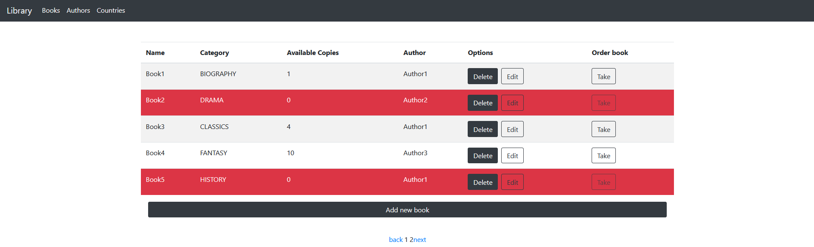
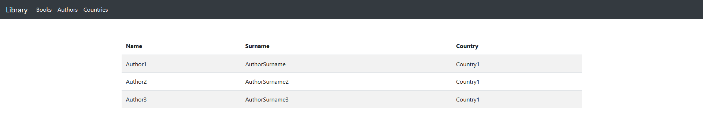

    
    
# Library

## Table of Contents

- [Description](#description)
- [Screenshots](#screenshots)
- [Built With](#built-with)
- [Contacts](#contacts)

## Description

## About Library project
One of two parts of creating an app called Library. The app is about creating new book if you have role admin. When you've created a book it can be ordered by many users. You decide whether you have physical copies of your book or you will send them online version.

## Technologies used to develop this app
Behind this app is running React Framework, since this is the frontend of the app. The other part is built using Java Spring Boot Framework.
Also for a better user experience I've included bootstrap, html, css and javascript. Those will affect the visual side, but also it makes the app easy to use.

This app is made as a school project by Bojan Dukovski.

## Screenshots
This is where all the books are listed. You take next action from here.

If you create a profile your name would be in this 'list of authors'.

## Built With

## Contacts

  
